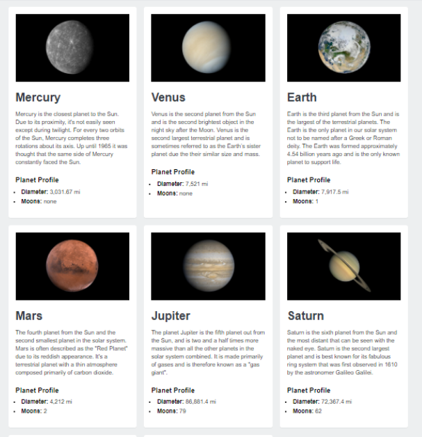

# React Component Exercise

Welcome to the React Component Exercise! In this exercise, you will have the opportunity to practice your skills with JSX, creating and rendering components, passing down props, and iterating over data, among other things.

## Project Overview

You will be using React to build a Planet Card Site by breaking it up into smaller components. Please note that you must use a Content Delivery Network (CDN) for your development.

## Getting Started

To get started with this exercise, follow these steps:

1. Open the project enclosed file.
2. Take a look at the `app.js` file.
3. Review the instructions provided in the `app.js` file.
4. Start building the React program that will render the specified image.

## Project Requirements

To successfully complete this exercise, you need to meet the following requirements:

- Functional React Program: Your program should be functional and implemented using React.

- Utilize Props and Loops: You are required to use props and loops to build this page.

### Scoring Criteria

Your exercise will be evaluated based on the following criteria:

- Functional and using React (3 marks)
- Using Props (1 mark)
- Using Loops (1 mark)
- Adding Delete Functionality to Each Card (1 mark)

## Project Files

All necessary files for this exercise, including HTML, CSS, images, and a JavaScript file, are provided in the folder. In the `index.html` file, you will find links to React, ReactDOM, and the Babel transpiler at the bottom of the file.

## Writing Your React Code

You will be writing your React code inside the `app.js` file. Currently, `app.js` contains an array of objects assigned to the constant `planets`. Each object has properties that describe a planet, such as name, diameter, moons, and a description. Additionally, each object has a URL property pointing to an image located in the `images` folder.

In the `index.html` file, you can find an example of the markup you'll need to use to create a planet card in the comments.

### Component Creation

Just below the `planets` array in `app.js`, you will create two components:

1. **Planet Component**: This component should render a planet card.

2. **Container Component**: This component will iterate over the `planets` array and render a `Planet` component for each object in the array.

### Passing Data Using Props

You need to pass the planet's data to the main container, and then pass that data down to the planet card using props. You should use the commented markup in `index.html` as a reference for how to display the data.

The only text that should not use props is the `h3` with the text "Planet Profile" and the text between the `<strong>` tags. Everything else needs to be displayed using props.

To display the planet cards, you will need to render the main container component to the DOM.
